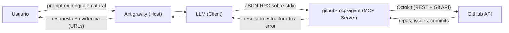

# github-mcp-agent

MCP Server en Node.js + TypeScript que expone herramientas (tools) para automatizar operaciones de GitHub —crear repositorios, gestionar issues y hacer commits— usando lenguaje natural a través de un agente de IA conectado por el Model Context Protocol (MCP).

Proyecto integrador del Módulo 5 (Backend) de Henry — AI Agents y Model Context Protocol.

## Qué hace y por qué es útil

Equipos de desarrollo repiten constantemente las mismas tareas administrativas en GitHub: crear un repo para un proyecto nuevo, abrir un issue para hacer seguimiento de una tarea, o subir un archivo de documentación. Este servidor le da a un agente de IA (dentro de Antigravity, o cualquier host compatible con MCP) la capacidad de ejecutar esas acciones reales sobre GitHub a partir de un pedido en lenguaje natural, con:

- **Validación estricta de inputs** (Zod) antes de tocar la API.
- **Resultados verificables**: cada acción devuelve URLs reales de GitHub para confirmar que ocurrió.
- **Errores en lenguaje natural**, nunca stack traces técnicos.
- **Reintentos automáticos** solo cuando corresponde (rate limiting), nunca ante errores de autenticación o validación.

Casos de uso típicos: "Creá un repo nuevo para el proyecto X", "Listá mis repos privados", "Abrí un issue para trackear este bug", "Actualizá el README con este contenido".

## Arquitectura



- **Host (Antigravity)**: recibe el pedido del usuario y orquesta la experiencia.
- **Client (LLM)**: decide qué tool invocar y con qué parámetros, en base a la descripción de cada tool.
- **Server (este proyecto)**: valida el input, ejecuta la operación contra GitHub y devuelve un resultado o error estructurado.
- **GitHub API**: fuente de verdad; cada acción es verificable con una URL real.

## Requisitos

- Node.js **18+** (probado con Node 24)
- Una cuenta de GitHub con un [Personal Access Token](#obtener-un-github-personal-access-token)
- [Antigravity](https://antigravity.google/) (u otro host compatible con MCP) para usar el agente en lenguaje natural
- [MCP Inspector](https://github.com/modelcontextprotocol/inspector) (se ejecuta con `npx`, no requiere instalación previa) para debugging

## Instalación

```bash
git clone https://github.com/WilliamSCoral/ProyectoM5_WilliamCoral.git
cd ProyectoM5_WilliamCoral
npm install
npm run build
```

## Configuración

### 1. Obtener un GitHub Personal Access Token

1. Andá a [github.com/settings/tokens](https://github.com/settings/tokens).
2. **Generate new token** → **Generate new token (classic)**.
3. Ponele un nombre descriptivo (ej. `mcp-github-agent`) y una expiración.
4. Tildá los siguientes scopes:
   - `repo` (crear/leer repositorios, issues y commits)
   - `user` (leer datos del usuario autenticado)
   - `admin:org` (si vas a operar sobre repositorios de una organización)
5. **Generate token** y copialo — GitHub solo lo muestra una vez.

### 2. Configurar `.env`

```bash
cp .env.example .env
```

Editá `.env` y completá:

```
GITHUB_TOKEN=ghp_tu_token_aqui
LOG_LEVEL=info
```

`.env` está en `.gitignore` — nunca se sube al repositorio.

### 3. Configurar el MCP server en Antigravity

1. Abrí Antigravity IDE (no la app liviana de chat — el servidor necesita ejecutar un proceso local, y eso requiere el IDE completo).
2. Abrí como workspace la carpeta de este proyecto.
3. Andá a **Settings → Terminal & Tooling Permissions → MCP Tools → Manage MCP Servers → View raw config**.
4. Agregá esta entrada dentro de `mcpServers` (sin borrar otros servidores que ya tengas):

```json
{
  "mcpServers": {
    "github-mcp-agent": {
      "command": "node",
      "args": ["/ruta/absoluta/a/tu/proyecto/dist/server.js"],
      "env": {
        "GITHUB_TOKEN": "TU_TOKEN_AQUI"
      }
    }
  }
}
```

5. Guardá el archivo y volvé a **Manage MCP servers → Refresh**. Deberías ver `github-mcp-agent` con sus 5 tools habilitadas.

> Antigravity ejecuta el servidor como un proceso independiente, por lo que necesita su propia copia del token en `env` — no lee el `.env` del proyecto.

## Tools disponibles

### `create_repository`

Crea un nuevo repositorio de GitHub bajo la cuenta autenticada.

| Parámetro | Tipo | Requerido | Descripción |
|---|---|---|---|
| `name` | string | Sí | 3-100 caracteres, solo `a-zA-Z0-9_.-`, sin espacios |
| `description` | string | No | Máximo 350 caracteres |
| `private` | boolean | No (default `false`) | Si el repo se crea privado |

**Prompt de ejemplo:** *"Creá un repositorio privado llamado `api-clientes` con la descripción 'API interna de gestión de clientes'"*

### `list_repositories`

Lista los repositorios del usuario autenticado.

| Parámetro | Tipo | Requerido | Descripción |
|---|---|---|---|
| `type` | enum: `all`\|`public`\|`private` | No (default `all`) | Filtro de visibilidad |
| `sort` | enum: `created`\|`updated`\|`pushed`\|`full_name` | No (default `updated`) | Criterio de orden |
| `per_page` | number (1-100) | No (default `30`) | Cantidad máxima a devolver |

**Prompt de ejemplo:** *"Listá mis repositorios públicos"*

### `create_issue`

Abre un nuevo issue en un repositorio existente.

| Parámetro | Tipo | Requerido | Descripción |
|---|---|---|---|
| `owner` | string | Sí | Usuario u organización dueño del repo |
| `repo` | string | Sí | Nombre del repositorio |
| `title` | string | Sí | Mínimo 3, máximo 256 caracteres |
| `body` | string | No | Contenido en Markdown, máximo 10000 caracteres |

**Prompt de ejemplo:** *"Creá un issue en el repo api-clientes con el título 'Agregar validación de email' y describí que falta validar el formato en el endpoint de registro"*

### `list_issues`

Lista los issues de un repositorio conocido.

| Parámetro | Tipo | Requerido | Descripción |
|---|---|---|---|
| `owner` | string | Sí | Usuario u organización dueño del repo |
| `repo` | string | Sí | Nombre del repositorio |
| `state` | enum: `open`\|`closed`\|`all` | No (default `open`) | Filtro por estado |
| `per_page` | number (1-100) | No (default `30`) | Cantidad máxima a devolver |

**Prompt de ejemplo:** *"Mostrame los issues abiertos del repo api-clientes"*

### `create_commit`

Crea o actualiza un archivo en un repositorio mediante un commit directo a una rama.

| Parámetro | Tipo | Requerido | Descripción |
|---|---|---|---|
| `owner` | string | Sí | Usuario u organización dueño del repo |
| `repo` | string | Sí | Nombre del repositorio |
| `branch` | string | No (default `main`) | Rama destino |
| `path` | string | Sí | Ruta relativa del archivo (ej. `docs/README.md`) |
| `content` | string | Sí | Contenido en texto plano |
| `message` | string | Sí | Mensaje del commit |

**Prompt de ejemplo:** *"Creá un archivo llamado CHANGELOG.md en el repo api-clientes con el contenido '# Changelog\n\n## v1.0.0 - Release inicial'"*

## Ejemplos de uso probados

Estos tres prompts fueron probados en vivo desde Antigravity (evidencia en [`docs/evidencia/`](docs/evidencia)):

| Prompt | Tool invocada | Resultado |
|---|---|---|
| "Listá mis repositorios públicos" | `list_repositories` | Tabla con los repos públicos y sus URLs |
| "Creá un issue en el repo ProyectoM5_WilliamCoral con el título 'Test de integración desde Antigravity'" | `create_issue` | Issue #1 creado |
| "Creá un archivo llamado evidencia.md en el repo ProyectoM5_WilliamCoral con el contenido 'Prueba desde Antigravity'" | `create_commit` | Commit real en `main` |

> ⚠️ **Alcance de las pruebas en vivo**: si vas a probar `create_issue`, `create_commit` o `create_repository` contra una cuenta real de GitHub, hacelo **únicamente sobre el repositorio `ProyectoM5_WilliamCoral`** (este mismo proyecto). No apuntes esas tools a otros repositorios de la cuenta, ya que pueden contener información sensible no relacionada con esta demo.

## Testing

```bash
npm run test
```

30 tests con Vitest, **cero llamadas a la red real** (todo mockeado con `vi.fn()`):

- `tests/tools.test.ts` — validación de los 5 schemas de Zod (casos válidos e inválidos).
- `tests/github.test.ts` — las operaciones de `operations.ts` con Octokit mockeado, incluyendo el flujo completo de 6 pasos de `create_commit`.
- `tests/errors.test.ts` — traducción de errores (401/403/404/422/Zod) y el retry con exponential backoff.

Verificación manual adicional con MCP Inspector:

```bash
npx @modelcontextprotocol/inspector node dist/server.js
```

## Estructura del proyecto

```
src/
  tools/       — registro de cada tool en el servidor MCP (contrato + handler)
  schemas/     — contratos de entrada con Zod
  github/      — client.ts (Octokit) separado de operations.ts (lógica de negocio)
  errors/      — jerarquía de errores custom y traducción a lenguaje natural
  utils/       — logging estructurado (stderr) y retry con backoff
  server.ts    — entry point: crea el servidor MCP y registra las tools
  types.ts     — DTOs compartidos
tests/         — suite de Vitest (schemas, operaciones mockeadas, errores)
docs/evidencia/ — capturas de MCP Inspector y Antigravity
```

## Troubleshooting

| Error (code) | Causa probable | Acción recomendada |
|---|---|---|
| `AUTH_ERROR` | `GITHUB_TOKEN` ausente, inválido o expirado | Revisá `.env` (o el `env` en `mcp_config.json` de Antigravity) |
| `VALIDATION_ERROR` | Input no cumple el schema (ej. nombre de repo inválido) | Corregí el input según la tabla de parámetros de la tool |
| `GITHUB_API_ERROR` (403, sin rate limit) | Permisos insuficientes | Revisá los scopes del token (`repo`, `user`, `admin:org`) |
| `GITHUB_API_ERROR` (403, rate limit) | Límite de la API de GitHub alcanzado | El servidor reintenta automáticamente con backoff (1s, 2s, 4s) |
| `GITHUB_API_ERROR` (404) | Repositorio, owner o issue no encontrado | Verificá que `owner`/`repo` sean correctos y existan |
| `GITHUB_API_ERROR` (422) | El recurso ya existe o datos inválidos para GitHub | Revisá el mensaje específico devuelto por GitHub |
| El servidor no aparece en Antigravity | Ruta incorrecta en `args`, o `npm run build` no se corrió | Verificá que `dist/server.js` exista y la ruta en `mcp_config.json` sea absoluta |
| "GITHUB_TOKEN no está configurado" al arrancar | Falta `.env` o está vacío | `cp .env.example .env` y completá el token |

## Licencia

MIT — ver [LICENSE](LICENSE).
